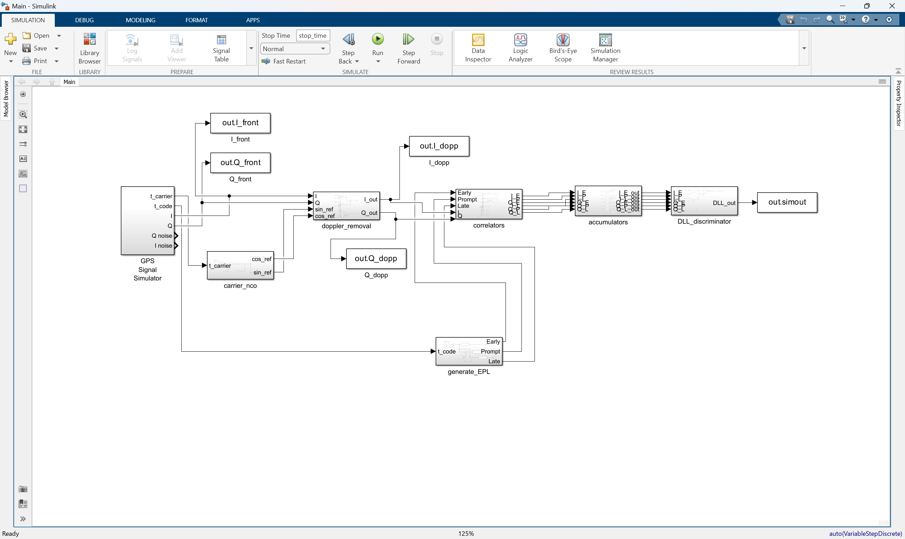
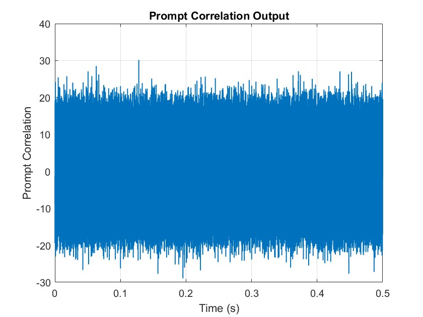
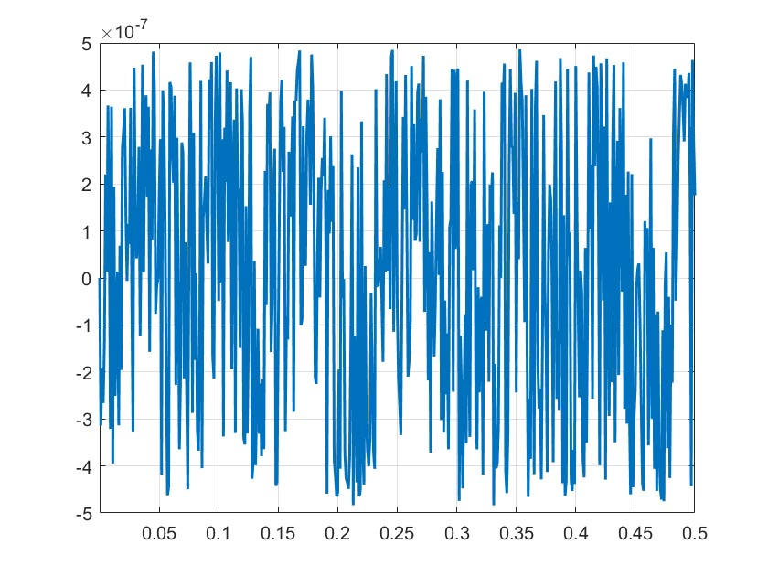

# GPS Code Tracking Receiver (DLL)

MATLAB/Simulink implementation of a GPS L1 C/A code tracking loop using Delay Lock Loop (DLL) techniques.

---

## Overview

This project implements the code tracking stage of a GPS receiver and demonstrates code phase error estimation using a Delay Lock Loop (DLL).

The implemented receiver architecture includes:

- GPS signal generation
- GPS L1 C/A code generation
- Carrier wipe-off stage
- Early-Prompt-Late correlators
- Integrate-and-Dump accumulators
- DLL discriminator
- Code phase error estimation

---

## Main Contributions

- Implementation of a GPS L1 C/A code tracking loop using a non-coherent DLL discriminator.
- Development of a complete MATLAB/Simulink receiver model.
- Sensitivity analysis under multiple SNR levels and integration times.
- Evaluation under carrier phase and frequency errors.
- Performance assessment using discriminator output statistics.

---

## Academic Context

This project was developed during M.Sc. studies in Communication Systems and Networks at Tampere University.

The MATLAB code, Simulink model implementation, debugging process, and performance evaluation were independently developed by the author.

---

## System Architecture

---

## Example Results

### Prompt Correlation Output

The prompt correlator output remains stable throughout the simulation and indicates successful code alignment with the incoming GPS signal.

### DLL Tracking Error

The DLL discriminator output remains centered around zero, demonstrating proper code tracking performance under the selected simulation conditions.

---

## Performance Evaluation

The DLL discriminator was evaluated under multiple SNR conditions and different integration times (PIT). Additional tests were also performed by introducing carrier phase and frequency errors to analyze their impact on code tracking performance.

The numerical results show that the DLL output error standard deviation remains approximately within the 83–85 m range across the tested conditions. This behavior is consistent with the normalized non-coherent DLL discriminator structure.

Detailed numerical results and sensitivity analysis are provided in the accompanying [GPS_Code_Tracking_Report.pdf](GPS_Code_Tracking_Report.pdf) document.

---

## Repository Contents

- Main.slx
- load_params.m
- generateCAcodes.m
- GPS_Code_Tracking_Report.pdf

---

## Technologies

- MATLAB
- Simulink
- GPS
- GNSS
- Signal Processing

---

## 👨‍💻 Author

**Alireza Ramyad**  
MSc Student in Communication Systems and Networks — Tampere University

